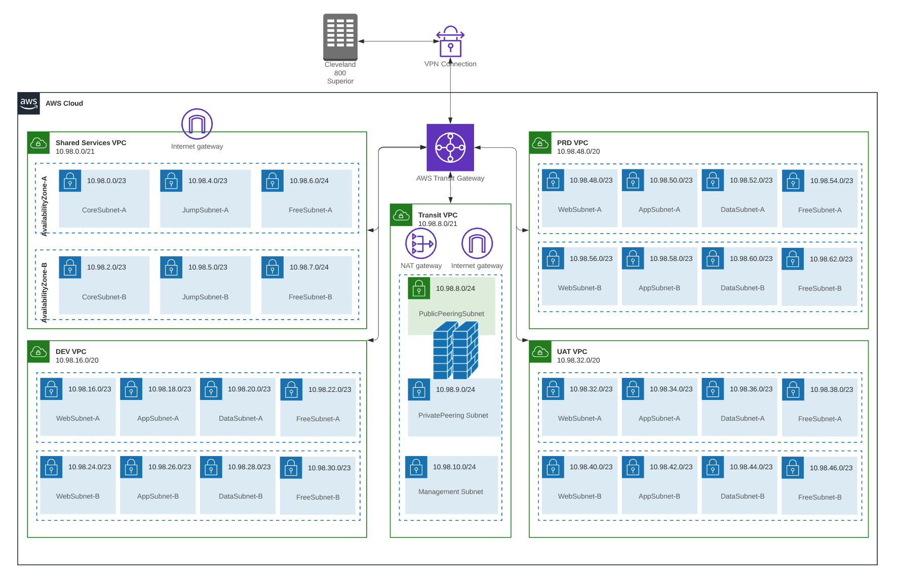
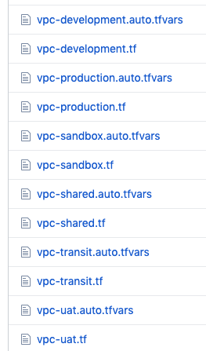
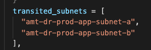
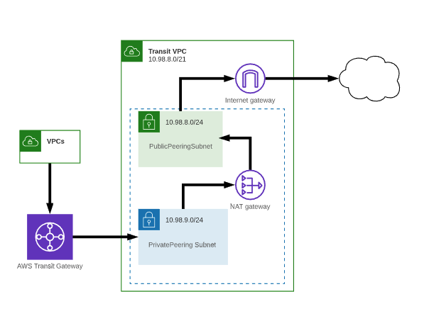
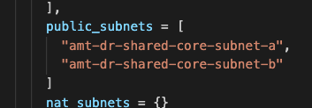
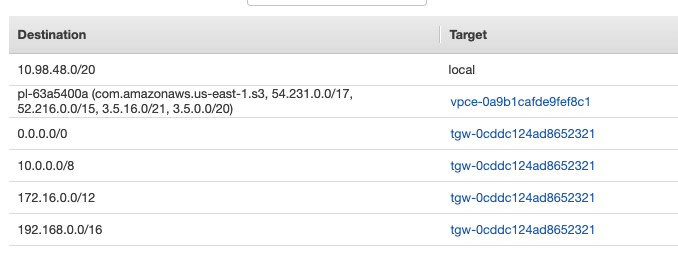
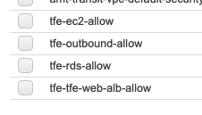
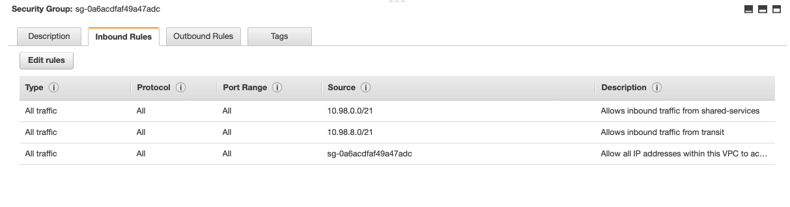
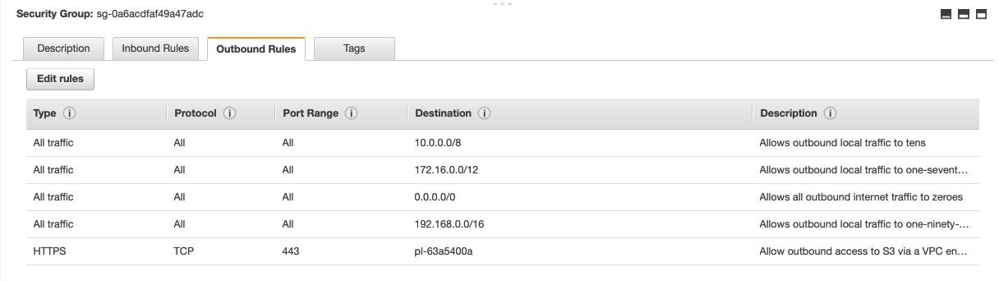

Prepared by
Insight, Inc.
3/26/2020

# Network Automation

Insight worked closely with AmTrust's Network Team to create a standard
reference architecture and define an overall technical approach to AWS
deployments. The deployments happen via Terraform checked into GitHub.
Any change to the master branch amt-network-setup repository will
trigger Terraform Enterprise (TFE) to run a plan and apply on the
codebase. There is a gate in place requiring manual approval before
any network changes are made.

GitHub: <https://github.com/amtrust/AWSCloudAutomation>

TFE:
<https://tfe.amtrustgroup.com/app/AmTrust/workspaces/amt-network-setup/runs>

The network team maintains the architectural diagrams.

Reference architecture:



## Transit Gateway

The [AWS Transit Gateway](https://docs.aws.amazon.com/vpc/latest/tgw/what-is-transit-gateway.html)
is the hub of the entire network. All traffic between VPCs, VPCs and
VPN, and inbound/outbound to the internet will most likely be routed by
the transit gateway. It also houses the VPN endpoints and will route all
traffic to/from on-premises. One major benefit of the transit gateway is
centralized routing and connectivity for any new Amazon VPC,
on-premises data center, or remote network. In addition, the transit gateway
simplifies configuration of the routes to those resources. There is significant
complexity in the setup of this resource though. The transit gateway is one of
the first resources that Terraform will create because of its
foundational position in the infrastructure .

The gateway is shared to all accounts within the organization, because it makes 
connections across accounts and to all VPC networks. When creating a connection 
to a VPC, a connection request is created on the transit gateway side, and if 
the VPC is in another account, an acceptor is created on the VPC side. The Terraform
VPC modules will handle creating their respective transit gateway connections.

Transit gateway attachment -- located in the VPC module, connects VPCs
to transit gateways.
- <https://github.com/amtrust/AWSCloudAutomation/blob/master/tf/amt-network-setup/modules/vpc/transit_gateway_attachment.tf>

The transit gateway itself is deployed in a module that is only
responsible for the gateway and sharing the gateway with the
organization.

Transit gateway module -- Creates the transit gateway.
- <https://github.com/amtrust/AWSCloudAutomation/tree/master/tf/amt-network-setup/modules/transit_gateway>

Each transit gateway attachment will get its own route table. This
allows control over what other networks are routable by each VPC. By its
nature the transit gateway is transitive, and these route tables will be 
configured to blackhole any routes that should not be accessible.

Transit gateway route module
- <https://github.com/amtrust/AWSCloudAutomation/tree/master/tf/amt-network-setup/modules/transit_gateway_route_table>

Transit gateway routes:

- [tgw-routes-dev.tf](https://github.com/amtrust/AWSCloudAutomation/blob/master/tf/amt-network-setup/tgw-routes-dev.tf)
- [tgw-routes-production.tf](https://github.com/amtrust/AWSCloudAutomation/blob/master/tf/amt-network-setup/tgw-routes-production.tf)
- [tgw-routes-sandbox.tf](https://github.com/amtrust/AWSCloudAutomation/blob/master/tf/amt-network-setup/tgw-routes-sandbox.tf)
- [tgw-routes-shared.tf](https://github.com/amtrust/AWSCloudAutomation/blob/master/tf/amt-network-setup/tgw-routes-shared.tf)
- [tgw-routes-transit.tf](https://github.com/amtrust/AWSCloudAutomation/blob/master/tf/amt-network-setup/tgw-routes-transit.tf)
- [tgw-routes-uat.tf](https://github.com/amtrust/AWSCloudAutomation/blob/master/tf/amt-network-setup/tgw-routes-uat.tf)
- [tgw-routes-vpn.tf](https://github.com/amtrust/AWSCloudAutomation/blob/master/tf/amt-network-setup/tgw-routes-vpn.tf)

## VPC

All VPCs are defined using a terraform file with an associated tfvars file.



These files are all located at the top level in the amt-network-setup
repository. These files can contain multiple VPCs per and are used to
define the Primary, DR, and Sandbox versions of the VPCs. The tfvars
files are variable files that contain the necessary info to
deploy the VPCs including: CIDR ranges, subnet names, subnet shares
(necessary to share subnets with client accounts I.e. Omnius),

E.x. Prod VPC tfvars file:

<https://github.com/amtrust/AWSCloudAutomation/blob/master/tf/amt-network-setup/vpc-production.auto.tfvars>

This info is passed into the VPC module, and any changes or additions to
the VPC would be added into this file.

The VPC module also sets up the transit gateway attachments. When you
attach a VPC to a transit gateway, you must specify one subnet from each
Availability Zone to be used by the transit gateway to route traffic.
Specifying one subnet from an Availability Zone enables traffic to reach
resources in every subnet in that Availability Zone. These subnets are
also defined within the tfvars file.



### Internet Connectivity

Any instances deployed within AmTrust VPCs should have basic access
outbound to perform updates. All internet connectivity outbound is
passed through the transit VPC. To obtain outbound without the use of
public IPs on all instances there is a [NAT gateway](https://docs.aws.amazon.com/vpc/latest/userguide/vpc-nat-gateway.html)
set up to enable this outbound connectivity. Future plans will replace
this gateway with Palo Alto firewalls. We route all outbound traffic to
the private peering subnet in the transit VPC. From there the traffic
goes to the NAT gateway to get the public address for return traffic.
Then out through the public subnet and the Internet Gateway.



There is also the ability to specify subnets that should have direct
connectivity to their own Internet Gateway. This has been done in the
Shared Services VPC to allow TFE to have a public inbound endpoint. The
VPC module will deploy the gateway and set up routes if the variable
"public_subnets" is set. Looking in the
[vpc-shared.auto.tfvars](https://github.com/amtrust/AWSCloudAutomation/blob/master/tf/amt-network-setup/vpc-shared.auto.tfvars)
file this configuration can be seen:\


<span style="color:red">NOTE: Using IGW's for ingress is an anti-pattern because
it bypasses network-based IDS/IDP protections. Instead, Palo Altos should be
provisioned to provide external inbound endpoints</span>

### Routes

VPC route tables will handle all traffic from subnets to various
destinations. These routes are set up by passing in the appropriate CIDR
blocks to the VPC module. Since the Transit Gateway does all routing
between VPCs, VPNs, and the outside world these VPC routes mostly point
to the transit gateway. The exceptions here would be if there were
Internet Gateways for specific VPCs and any VPC endpoints.

Terraform:

<https://github.com/amtrust/AWSCloudAutomation/blob/master/tf/amt-network-setup/modules/vpc/route_tables.tf>

This Terraform will update the default routes applied to each VPC.

Example Prod default route table:



### Security Groups

Security Groups are applied at the instance level. The security groups
follow a similar pattern as the route tables. Any instances that are
brought up should also create the appropriate security groups to control
traffic to/from them. A good example of this is the TFE deployment as it
creates multiple security groups to control traffic.



The network deployment updates the default security groups for each VPC.
If applied these rules will allow all traffic within the VPC, any
traffic from Transit and/or Shared VPCs, all traffic to cross the VPN,
and traffic outbound to the internet.

Terraform for default security group:
<https://github.com/amtrust/AWSCloudAutomation/blob/master/tf/amt-network-setup/modules/vpc/security_groups.tf>

Example Prod Tables:

Inbound



Outbound




## VPN

The Transit Gateways are the current terminus of VPN connections into
AWS. This is where the tunnels from on premise are, and if there are any
additional VPNs needed they will be attached to the Transit Gateway. The
VPN consists of 2 parts:
- Customer Gateway
- VPN Connection

Both are defined in terraform here:
<https://github.com/amtrust/AWSCloudAutomation/blob/master/tf/amt-network-setup/modules/vpn/main.tf>

Unfortunately one of these resources (the VPN connection) can't be
created ahead of time. This is due to the fact that Terraform only
returns after the VPN connection and tunnels are up and functional. If
the other end of the tunnel is not configured, then Terraform will just
hang indefinitely. Because of this it is recommended to manually create
the VPN connection first. Then import the configuration into Terraform
once the tunnels are up. This will ensure that if the VPN connection is
deleted, it can be recreated by just running a terraform apply on the
network repositiory.

Manual VPN Creation:
[https://docs.aws.amazon.com/vpn/latest/s2svpn/create-tgw-vpn-attachment.html](https://docs.aws.amazon.com/vpn/latest/s2svpn/create-tgw-vpn-attachment.html)

To import the connection into Terraform:
<https://www.terraform.io/docs/providers/aws/r/vpn_connection.html>

```shell
terraform import aws_vpn_connection.testvpnconnection <VPN ID>
```
