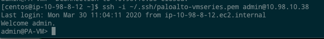
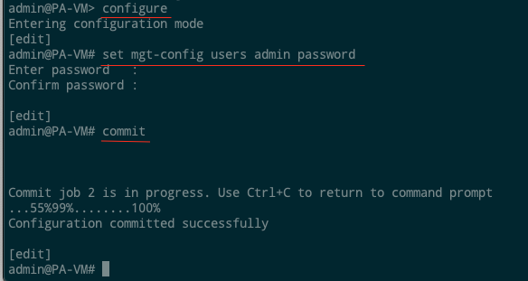
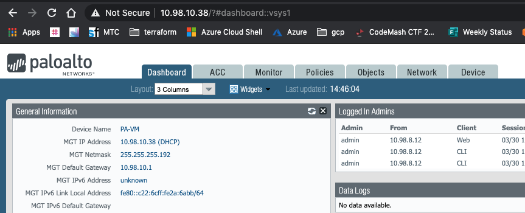

Prepared by
Insight, Inc.
3/26/2020

# Palo Alto VM-Series in AWS

The original Terraform developed was intended to deploy all components
of and "active/passive" pair. All of the steps are detailed in the Palo
Alto documentation for [High Availability for VM-Series Firewall in
AWS](https://docs.paloaltonetworks.com/vm-series/7-1/vm-series-deployment/set-up-the-vm-series-firewall-in-aws/high-availability-for-vm-series-firewall-in-aws).
Palo has great documentation and it is highly encouraged that anyone
deploying or configuring these devices becomes familiar with it.

<https://docs.paloaltonetworks.com/vm-series/7-1/vm-series-deployment>

The components needed for the HA setup include:

- Instances
- Network interfaces
- Elastic IPs
- IAM role and policy (for HA failover)

None of the actual Palo configuration is done within Terraform and needs
to be handled manually or by utilizing tools like Ansible and Panorama.
Terraform will only deploy the infrastructure.

This code can easily be changed to omit the roles and policy for HA, and
instead used to deploy any \# of Palo Alto VM-Series instances.

# Terraform

The root level file
[firewalls.tf](https://github.com/amtrust/AWSCloudAutomation/blob/master/tf/amt-network-setup/firewalls.tf)
is the entry point in the code that creates the firewalls. It only makes
a call out to the module (which will deploy the actual instances) and
passes in necessary values.

The values the module needs are:
```terraform
palo_ami = var.palo_ami
server_key_name = var.palo_key_name
public_subnet_id = module.transit_vpc.subnet_ids["amt-transit-public-subnet-a"]
private_subnet_id = module.transit_vpc.subnet_ids["amt-transit-private-subnet-a"]
management_subnet_id = module.transit_vpc.subnet_ids["amt-transit-mgmt-subnet-a"]
```

The `palo_ami` and `server_key_name` are both stored in the
[variables.tf](https://github.com/amtrust/AWSCloudAutomation/blob/master/tf/amt-network-setup/variables.tf)
file:

```terraform
variable "palo_ami" {
  type = string
  default = "ami-050725600cf371a1c"
}

variable "palo_key_name" {
  type = string
  default = "paloalto-vmseries"
}
```


The remaining subnet info is pulled directly from the transit\_vpc
module itself. The module contains all resources for the Palo instances
including the HA policy. Those resources are:

-   `resource "aws_iam_role" "firewall_ha_role"`
-   `resource "aws_iam_role_policy" "firewall_ha_policy"`
-   `resource "aws_iam_instance_profile" "fw_instance_profile"`

This module does not dynamically define any resources, instead it
explicitly codifies them (unlike most other modules in this
codebase). This enables maximum flexibility when deploying
instances, in that any one-off or custom configurations can easily
be captured. For example, if extra NICs are needed on only one
firewall then explicitly defining them here one by one will get them
added. This is instead of having one generic "template" with
multiple conditions or flags to account for variance. This was done
to simplify any future growth or additions.

The module contains
[main.tf](https://github.com/amtrust/AWSCloudAutomation/blob/master/tf/amt-network-setup/modules/firewall/main.tf)
and
[variables.tf](https://github.com/amtrust/AWSCloudAutomation/blob/master/tf/amt-network-setup/modules/firewall/variables.tf)
that contain the resources. All resources for a firewall are listed
in sections (policy, fw1, fw2, etc....). If HA is not the desired
deployment model, then that section of the module can be commented
out or removed. To add additional firewalls all that is needed is to
copy a firewall section and change the necessary values and names.

```terraform
########
# FW1
########
resource "aws_network_interface" "fw1_mgmt_interface" {
  subnet_id = var.management_subnet_id
...
```


Becomes
```terraform
########
# FW3
########
resource "aws_network_interface" "fw3_mgmt_interface" {
   subnet_id = var.management_subnet_id
...
```


# Post Deploy Config
Once the VM-Series firewalls have been deployed an administrator
password needs to be set via the CLI so that login and config can begin.
To log in to the CLI, you require the private key that you used to
launch the firewall (currently `paloalto-vmseries.pem`).

- Use the private eth0 IP address to SSH into the Command Line
  Interface (CLI) of the VM-Series firewall.
  - You will need the private key that you used to access the CLI.
    - If you are using PuTTY for SSH access, you must convert the .pem
      format to a .ppk format.
      [https://docs.aws.amazon.com/AWSEC2/latest/UserGuide/putty.html](https://docs.aws.amazon.com/AWSEC2/latest/UserGuide/putty.html)
    - Enter the following command to log in to the firewall:\
      `ssh -i <private_key.pem> admin@<ip_address>`\
      
- Configure a new password, using the following command and follow the 
  onscreen prompts:
    - `configure`
    - `set mgt-config users admin password`
    - `commit`\
      
- If you have a BYOL that needs to be activated, set the DNS server IP
  address so that the firewall can access the Palo Alto Networks
  licensing server.
  - Enter the following command to set the DNS server IP address:
    ```shell
    set deviceconfig system dns-setting servers primary <ip_address>
    commit
    ```
- Terminate the SSH session.
- Log into the mgmt interface at `https://<private_ip>`.



From here you can begin the configuration of the Palo Alto instances.

Steps detailing the general setup process are documented here (starting
on step 9):
<https://docs.paloaltonetworks.com/vm-series/7-1/vm-series-deployment/set-up-the-vm-series-firewall-in-aws/launch-the-vm-series-firewall-in-aws.html#44219>

If you are deploying HA pairs (starting on step 3):
<https://docs.paloaltonetworks.com/vm-series/7-1/vm-series-deployment/set-up-the-vm-series-firewall-in-aws/high-availability-for-vm-series-firewall-in-aws.html>

For either of these setups you will have to define the correct number of
ENIs to attach to each instance. The HA pair deployment does not need as
many as the general deployment.
