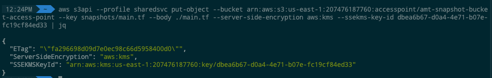

# S3 for VMware Snapshot Storage and SRM Backups

This is just an S3 private bucket deployed to store/backup any VMware
snapshots fronted by an [S3 Access Point](https://aws.amazon.com/s3/features/access-points/). Along with
the bucket and access point its necessary to define either the bucket
policy and/or access point policy. Furthermore, these policies must be
as restrictive or less than the policies set for the organization and
accounts otherwise the automation to deploy them will fail.

The deployment and configuration is handled by terraform and should be
easily extended if the need arises for more buckets. Current state has
this bucket in the SharedSvc account.

The files that create this bucket are located currently here:
[https://github.com/amtrust/AWSCloudAutomation/blob/master/tf/amt-network-setup/s3-buckets.tf](https://github.com/amtrust/AWSCloudAutomation/blob/master/tf/amt-network-setup/s3-buckets.tf)

The template consists of 6 elements:
- KMS Key (for encryption)
- KMS Key alias (to give our key a name, ease of use)
- S3 Bucket
- S3 Bucket Public Access Block (makes it private)
- S3 Access Point
- Access Point Policy file (.json)

Access to the bucket using the endpoint has to be through the
[s3api](https://docs.aws.amazon.com/cli/latest/reference/s3api/).

Below is an example for uploading a file called main.tf into the bucket
folder snapshots.

You will have to specify these params to successfully upload:
- `--profile <profile name>` -- must be a profile set up locally
  with appropriate AWS role ARN.
- `--bucket <bucket ARN>` -- obtainable from the [S3
  console](https://s3.console.aws.amazon.com/s3/home?region=us-east-1)
- `--key <file destination>` -- destination in the bucket
- `--body ./main.tf` -- the file to upload
- `--server-side-encryption aws:kms` -- the encryption used for the
  bucket. Enforced by policy
- `--ssekms-key-id dbea6b67-d0a4-4e71-b07e-fc19cf84ed33` -- id of the
  kms key found through [S3
  console](https://console.aws.amazon.com/kms/home?region=us-east-1#/kms/keys).
- Lastly the stdout is piped into `jq` to be able to see formatted
  output. This step is not required

```shell
$ aws s3api \
    --profile sharedsvc \
    put-object \
    --bucket arn:aws:s3:us-east-1:207476187760:accesspoint/amt-snapshot-bucket-access-point \
    --key snapshots/main.tf \
    --body ./main.tf \
    --server-side-encryption aws:kms \
    --ssekms-key-id dbea6b67-d0a4-4e71-b07e-fc19cf84ed33 \
  | jq
```

